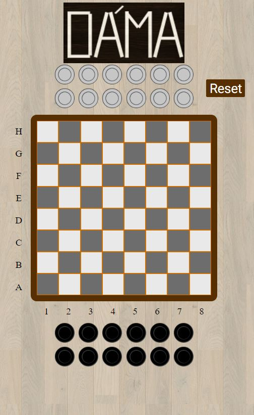
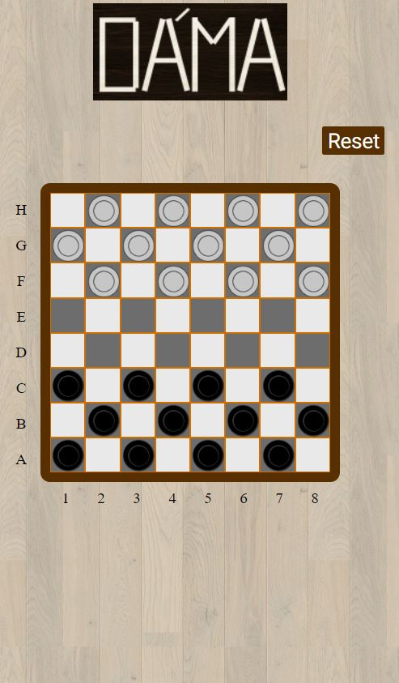
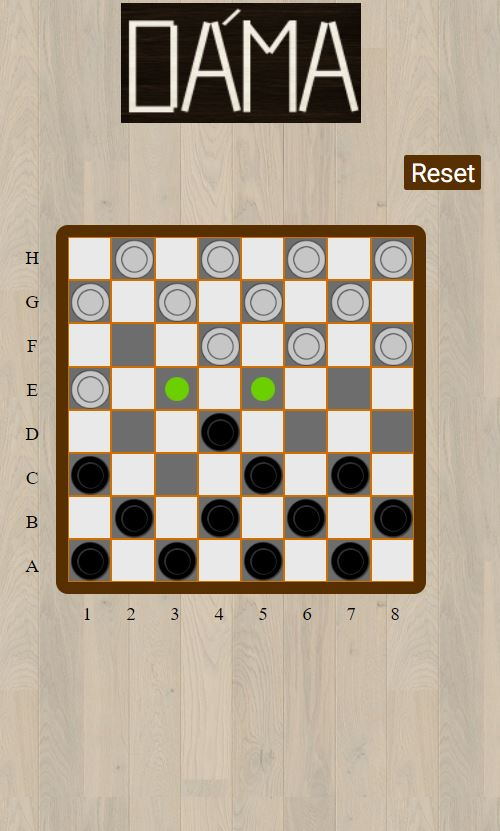

# Dáma #
Klasická královská stolní hra. Běžne se hraje na šachovníci 8x8. Jsou některé typy této hry, které se hrají i na větších šachovnicích, ale zde najdete zpracované podklady k verzi na šachovnici 8x8 s českými pravidly.
## Pravidla hry - Česká pravidla ##
- Hraje se na šachovnici 8x8.
- Soupeři mají na začátku po 12 kamenech stojících na protilehlých stranách v prvních třech řadách na černých políčkách.
- Pokud obyčejný kámen dojde na druhou stranu šachovnice, přemění se v dámu.
- Dáma se pohybuje diagonálně dopředu a dozadu o libovolný počet polí.
- Jestliže se kámen nachází na diagonále v sousedství soupeřovy figury, za kterou je volné pole, je povinen ji přeskočit, obsadit toto volné pole a odstranit přeskočenou soupeřovu figuru z desky.
- Skákání je povinné. Může-li hráč skákat jak dámou, tak obyčejným kamenem, musí skákat dámou. V případě, že může jedním kamenem provést více variant skoku, je na něm, kterou si vybere, musí ovšem variantu doskákat (např. když může jedním kamenem skočit jeden, nebo tři kameny, skočí tedy jeden, nebo tři. Nelze skočit jen dva z druhé varianty.)
- Při vícenásobném skoku se kameny odstraní až po dokončení celé sekvence. Přes jeden kámen nelze skákat vícekrát.
- Hráč, který je na tahu a nemůže hrát (nemá kameny, nebo má všechny zablokované), prohrál. Partie končí remízou tehdy, když je teoreticky nemožné vzít soupeři při pozorné hře žádnou další figuru.
-Jestliže některý z hráčů zahraje tah v rozporu s pravidly (např. opomenutí skákání), je na jeho protihráči, jestli bude vyžadovat opravu tahu, nebo ne.

## Funkce ##
- Kliknutím na kámen se zobrazí možnosti pohybu
- Hráč poté vybírá pohyb, který chce s kamenem provést
- Po vyřazení kamene ze hry se kámen dostává na odkládací místo (podle barvy)
- Vpravo nahoře máme tlačítko restart, kterým resetetujeme pozice kamenů do pozic pro novou hru

## Kódování ##
- Jednotlivé grafické prvky se na šachovnici přidávají pomocí class:
    * black-pawn
    * white-pawn
    * black-queen
    * white-queen
    * dot
- Tyto classy se aplikují na tagy (div)

Prázdné pole

```html
<div class="place white-place position-H1"></div>
```
Pole s grafickým prvkem
```html
<div class="place white-place position-H1 white-queen"></div>
```
## Hostovaný zdrojový kód ##
Zde naleznete hostovaný zdrojový kód: [Dáma demo]()
## Black-pawn ##

## White-pawn ##

## Black-pawn ##

## White-pawn ##

## Dot ##


# Ukázky: #
## Všechny kameny vyřazeny ##

## Nová hra (Po restartu) ##

## Rozehraná hra ##



